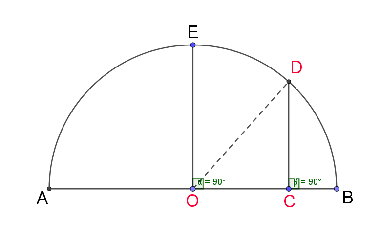

# 证明几何平均值小于等于算术平均值

### 方法一,采用数学归纳法,证明几何平均值小于等于算术平均值

$$
\\
即:
\sqrt[n]{ a_{1} \cdot a_{2}\cdot ... \cdot a_{n}}
\ll
\frac{a_{1}+a_{2}+...+a_{n}}{n} ,
n \in N
\\
于此设n=2,令算术平均值-几何平均值,则得:\\
\frac{a_{1}+a_{2}}{2} -
\sqrt[2]{ a_{1} \cdot a_{2}}
\\
\Rightarrow
\frac{a_{1}^2+2a_{1}a_{2}+a_{2}^2}{4}-
a_{1}a_{2}
\\
\Rightarrow
\frac{a_{1}^2+2a_{1}a_{2}+a_{2}^2-4a_{1}a_{2}}{4}
\\
\Rightarrow
\frac{(a_{1}-a_{2})^{2}}{4}
\\
\because \frac{(a_{1}-a_{2})^{2}}{4} \gg 0
\\
\therefore
\frac{a_{1}+a_{2}}{2}
\gg
\sqrt[2]{ a_{1} \cdot a_{2}}
\\
证明成立
$$

### 方法二: 几何法证明

如图:  

- O 点为圆心点,D 和 E 为半圆圆周上的点
- EO 垂直于 AB 于点 O,DC 平行于 EO
- DC 与 AB 相交于点 C
- D 点能在半圆圆周上滑动位置,C 点位置也会随 D 点的移动在 AB 上进行变动
- 但 DC 永远与 EO 平行,即永远垂直于 AB

$$\\ \\$$

设 AC=a,BC=b

$$\\ \\$$

$$
\because OA=OB=OD=\frac{a+b}{2},即r\\
OC=OB-BC= \frac{a+b}{2}-b=\frac{a-b}{2}
$$

$$\\ \\ $$

$$
\therefore CD=\sqrt[]{OD^{2}-OC^{2}} \\
=\sqrt[]{(\frac{a+b}{2})^{2} - (\frac{a-b}{2})^{2} } \\
=\sqrt[]{ab}
$$

$$ \\ \\ $$

$$
\because CD \ll r ,\quad
\therefore \sqrt[]{ab} \ll \frac{a+b}{2}
$$

$$ \\ \\ $$
因此几何平均值 小于等于 算术平均值
