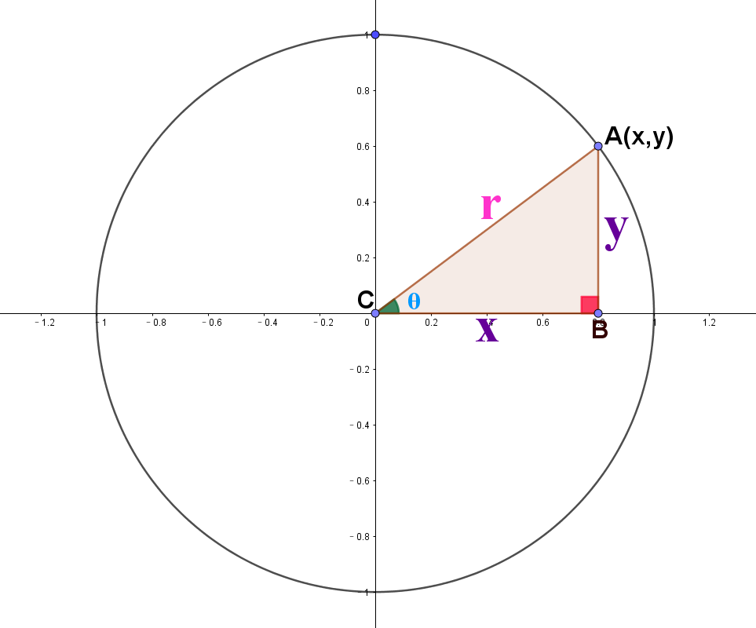
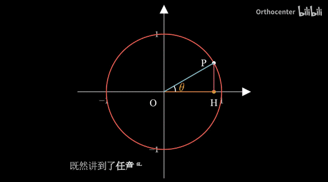

# 三角函数介绍

# basic definition

正弦: $sinθ=\frac{y}{r}$, $\quad 余弦:cosθ=\frac{x}{r}$, $\quad 正切: tanθ=\frac{y}{x}$

 
余切: $cotθ=\frac{x}{y}$, $\quad 正割: secθ=\frac{r}{x}$, $\quad 余割: cscθ=\frac{r}{y}$

# dynamic

- 如图,图中之圆以点$O$为圆心
   
- 三角形$POH$为直角三角形，线段$PH垂直OH于点H$,此三角形边长总和恒定
   
- $PO$为圆的半径，长度假设为 1
   
- $PH=x,OH=y,点P坐标为(x,y)$
   
- 点$P$在以$PO$为半径的圆周上滑动
   
- 点$H$则在横坐标轴上运动,而其移动范围不超过圆的直径

$PO= 1 =\sqrt[]{x^{2}+y^{2}}$

$sin\theta=\frac{y}{PO}=y $

$cos\theta=\frac{x}{PO}=x $

$P(cos\theta,sin\theta)$

$tan\theta = \frac{y}{x} = \frac{sin\theta}{cos\theta}$

# sin & cos

