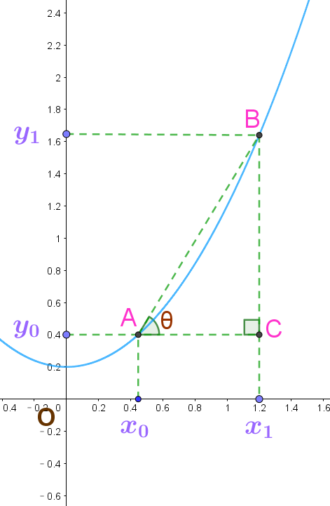

# 导数的介绍及其几何意义

**一个函数的导数可以大致理解为:该函数在某处的切线的斜率(slope),或者说,某点附近的曲线的变化率**

  
    
# 定义
  
   

设函数$y=f(x)在点x_{0}$的某一邻域内有定义,当自变量$x在x_{0}$处取得增量$\Delta x(点 x_{0}+\Delta x仍在该邻域内)时,$ 相应地因变量取得增量$\Delta y=f(x_{0}+\Delta x)-f(x_{0}),$
如果极限:

$$
\lim_{\Delta x \to 0}\frac{\Delta y}{\Delta x}= \lim_{\Delta x \to 0}\frac{f(x_{0}+\Delta x)-f(x_{0})}
{\Delta x}
$$

存在,则称函数$y=f(x)$在点$x_{0}$处可导, 并称该极限值为函数$y=f(x)$在点$x_{0}$处的导数.记作: $f'(x_{0}).$

$$\\ \\$$
$$即: \quad f'(x_{0})=\lim_{\Delta x \to 0}\frac{f(x_{0}+\Delta x)-f(x_{0})}{\Delta x} $$
$$\\ \\$$

$$
或: \quad y' | \left.  x=x_{0},\frac{dy}{dx}\right| \quad 或 \quad
y' |\left. x=x_{0},\frac{df(x)}{dx} \right|
$$

# 几何意义

**设$ y=f(x) $,其函数如下图所示**

$$AB的斜率= \frac{BC}{AC} = \frac {y_{1}-y_{0} } {x_{1}-x_{0} }= tanθ$$

$$\\ \\$$

$ 即 \quad tanθ=\frac {y*{1}-y*{0} } {x*{1}-x*{0} }= \frac{Δy} {Δx}, \quad Δy = y*{0} 至 y*{1}之间的距离$ (distance) $, \quad Δx = x*{0} 至 x*{1}之间的距离, $

$当B点沿曲线下滑而不断趋近于A点时,AB斜率就越精确.$

$$\\ \\$$

$$
\because y_{1}=f(x_{0}+Δx),\quad y_{0}=f(x_{0})
$$

$$\\ \\$$

$$
\therefore
\lim_{Δx\to 0}\frac{Δy}{Δx}=
\lim_{Δx\to 0}\frac{f(x_{0}+Δx)-f(x_{0})}{Δx}
=\frac{dy}{dx}
=tanθ
$$

$$\\ \\$$

$求f(x)的导数f'(x),在这里可近似地认为是在求AB的斜率,即求tanθ$
