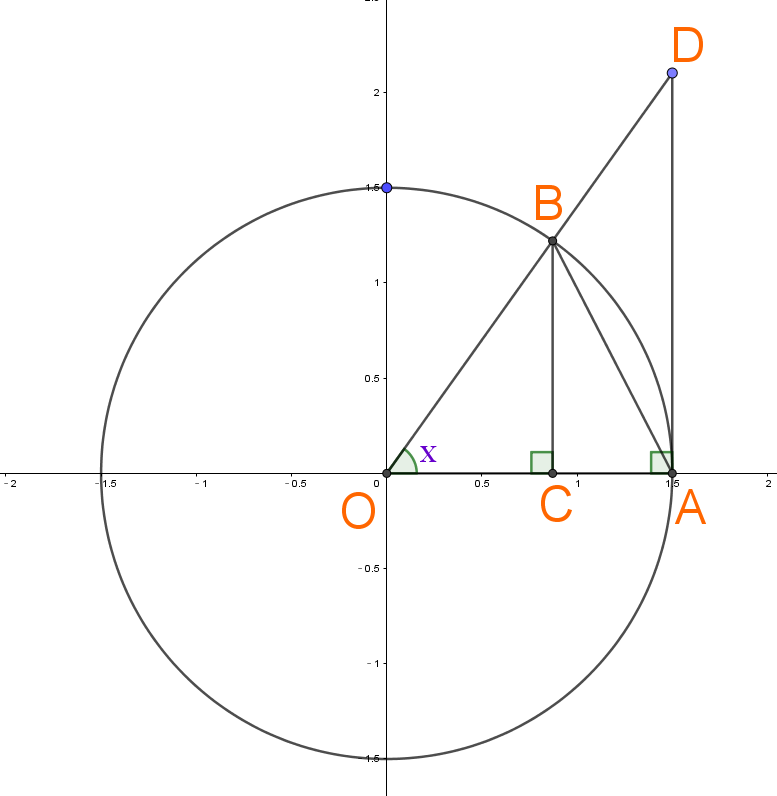

# 第一重要极限之推导

**第二重要极限证明**:https://www.cnblogs.com/Preparing/p/16576649.html

$$
证明极限\lim_{x\to 0}\frac{sinx}{x}=1
$$

$$\\ \\$$

$$
设∠AOB=x(0<x<\frac{π}{2}) \\
\because △AOB面积 < 扇形AOB面积 < △AOD面积
\\
$$

$$ \Rightarrow \frac{sinx\cdot r\cdot r}{2} < \frac{xπr^{2}}{2π} <\frac{tanx\cdot r\cdot r}{2}$$
$$ \\ \\$$

$$
约去\frac{1}{2}和r^{2}: sinx < x < tanx \\
除以sinx: 1<\frac{x}{sinx}<\frac{tanx}{sinx}\\
=1<\frac{x}{sinx}<\frac{1}{cosx}   \\
将不等式中每个数都变为倒数,原大小关系会变向:1>\frac{sinx}{x}>cosx \\
=cosx<\frac{sinx}{x}<1
$$

$$\\ \\$$

$$
\because cosx为偶函数[cosx=cos(-x)]\\
而\frac{sinx}{x}=\frac{sin(-x)}{-x} \\
\therefore 不等式在x \in [-\frac{π}{2}, 0) 照样成立
$$

$$\\ \\ $$
$$\therefore cosx<\frac{sinx}{x}<1 的定义域:x\in[-\frac{π}{2}, \frac{π}{2}],x\ne0$$

$$\\ \\$$

$$
\because \lim_{x\to 0}cosx=1,再由迫敛定理,得出:
\lim_{x\to 0}\frac{sinx}{x}=1
$$
