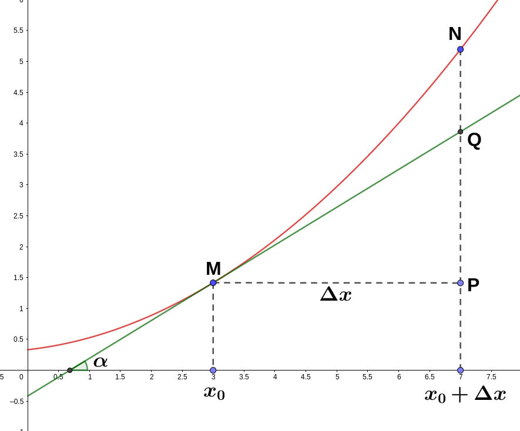

# 微分概念之介绍

# Differential

- 微分之作用: 通过微分可以描述,当函数自变量的取值发生了足够小的改变时,函数的值是怎样改变的.

- 微分与导数的关系非常密切, 函数在某一点可微分的充分必要条件为: 函数在这一点可导.

* 一元微分学中,可导与可微是等价的概念.
  - 可导: 意味着函数在点$x_{0}$处的切线的斜率存在.
  - 可微: 意味着函数在点$x_{0}$处存在切线.

  
  
  
# 与导数关系

接下来探究的是导数与微分之间存在的某种内在联系.

首先是问常数 $A=?$

设函数 $y=f(x)$ 在某一区间内有定义, $x_{0}$ 及 $x_{0}+\Delta x$ 在该区间内,若函数的增量:
$$\Delta y=f(x_{0}+\Delta x)-f(x_{0})$$

以上可表示为 $$\Delta y= A\Delta x+ o(\Delta x)$$

所以 $$f(x_{0}+\Delta x)-f(x_{0})=A\Delta x+ o(\Delta x)$$

两边同时除以$\Delta x$: $$\frac{f(x_{0}+\Delta x)-f(x_{0})}{\Delta x}=A+\frac{o(\Delta x)}{\Delta x}$$

引入极限: $$\lim_{\Delta x \to 0}\frac{f(x_{0}+\Delta x)-f(x_{0})}{\Delta x}=\lim_{\Delta x \to 0}A+\frac{o(\Delta x)}{\Delta x}$$

$$
\\
\Rightarrow f'(x_{0})=\lim_{\Delta x \to 0} A+
\lim_{\Delta x \to 0}\frac{o(\Delta x)}{\Delta x}
$$

$$\\ \\$$
$$\because \lim_{\Delta x \to 0}\frac{o(\Delta x)}{\Delta x} 是高阶无穷小除以低阶无穷小的极限 $$
$$\\ \\$$
$$\therefore f'(x*{0})=\lim*{\Delta x \to 0} A+ 0$$
$$\\ \\$$
$$f'(x\_{0})= A$$

由此得 $(y_{1}-y_{0})=f'(x_{0})(x_{1}-x_{0})$的意义: 代表函数$y=f(x)$在点$x_{0}$处形成切线, $(y_{1}-y_{0})=f'(x_{0})(x_{1}-x_{0})$ 可视为 1 个切线方程.
$(x_{1}-x_{0})$即对应 $o(\Delta x),  o(\Delta x)$代表了 $y=f(x)$ 的极其微小之增量.

由 $A \Delta x$ , 且通常把自变量的增量 $\Delta x$ 谓之为自变量的微分,即$\Delta x=dx $, 所以函数的微分亦可记为: $$ dy=f'(x*{0})dx $$
因此函数在某一点的导数便可表示为**函数的微分与自变量的微分的商**, 即: $$ \frac{dy}{dx}=f'(x*{0}) $$
所以导数亦谓之为**微商**

# 微分的几何意义

  
  
- [ ] 
  
  

  

$ 如上图所示,设 MQ 为曲线 y=f(x) 在点 M[x_{0},f(x_{0})]处的切线,由导数之几何定义: $

$$ \frac{dy}{dx}= f'(x\_{0})=tan\alpha $$

$ 其中 \alpha 为切线 MQ 与 x 轴之夹角,自变量 x\_{0}有 1 个增量\Delta x=MP, 则: $

$$dy=f'(x_{0})\Delta x=tan\alpha \cdot MP=PQ$$

$ 这个式子说明,当自变量从 x*{0}增至 x*{0}+\Delta x 时,曲线 y=f(x)在点 M[x_{0},f(x_{0})] 处的切线之纵坐标增量即为该点的微分. $

$ 也就是说,在微小的局部范围内,曲线弧段 MN 可以被切线段 MQ 近似代替,谓之“以直代曲”. $
